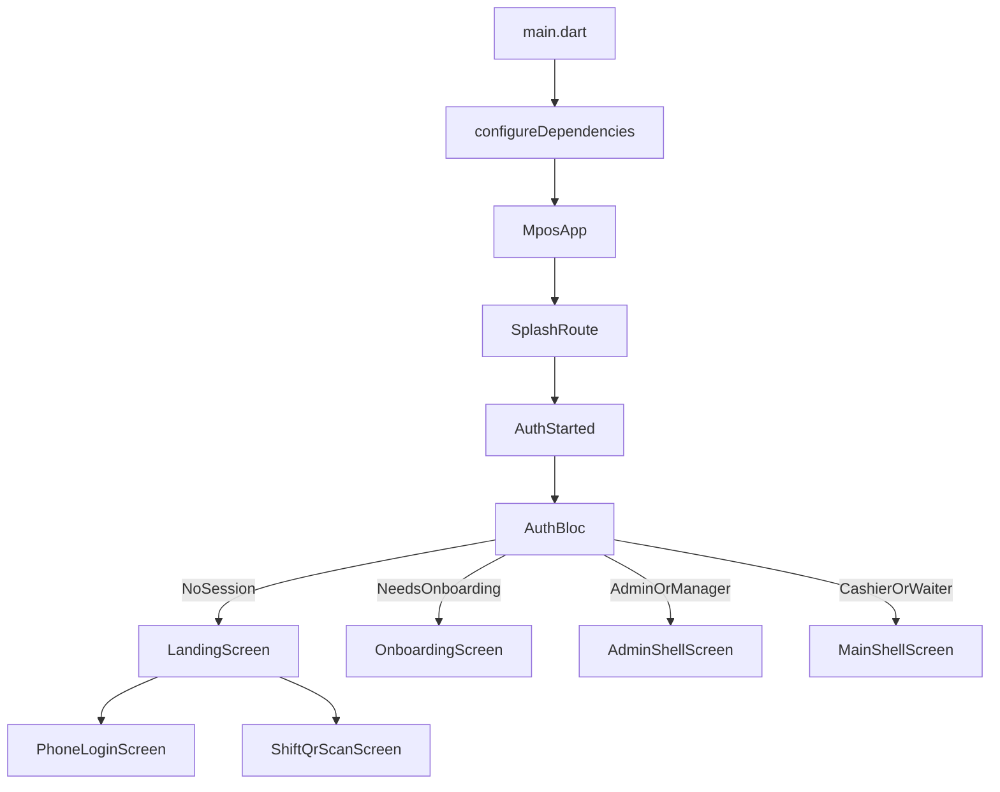

# App Flow

This page describes what happens from process start to the final shell the user sees.

## Bootstrap Sequence
`lib/main.dart` does four key things:
1. initializes Flutter bindings
2. initializes Supabase only when mock mode is off and Supabase settings are present
3. loads `SharedPreferences`
4. calls `configureDependencies()` and launches `MposApp`

## Global App Setup
`lib/app/mpos_app.dart` creates the global providers:
- `ThemeCubit`
- `LocaleCubit`
- `AuthBloc`
- `PosBloc`

`AuthBloc` immediately receives `AuthStarted()`, which means session restoration begins as soon as the app tree is built.

## Initial Route
The router starts at `/splash`.

`lib/features/splash/presentation/screens/splash_screen.dart` is a short branded waiting state while auth resolution is happening.

## Session Restoration
`AuthBloc` loads the stored session through `LoadSessionUsecase`.

Possible outcomes:
- stored session found and valid enough to continue
- no session stored
- backend or persistence returns no usable session

`AuthBloc` then emits one of:
- `AuthAuthenticated`
- `AuthNeedsOnboarding`
- `AuthUnauthenticated`

## Unauthenticated Flow
If no usable session exists, `MposApp` routes to `/landing`.

`lib/features/auth/presentation/screens/landing_screen.dart` offers two entry paths:
- phone OTP sign-in
- shift QR sign-in

### Phone OTP
`lib/features/auth/presentation/screens/phone_login_screen.dart`:
- loads or creates a device id
- dispatches `AuthOtpRequested(phone)`
- moves to a verification step when `AuthOtpSent` returns
- dispatches `AuthOtpVerified(requestId, code, deviceId, deviceName)` on submit

### Shift QR
`lib/features/auth/presentation/screens/shift_qr_scan_screen.dart`:
- scans a QR payload
- extracts a shift token from JSON or falls back to the raw payload
- dispatches `AuthShiftQrScanned`

## Session Classification
Once login succeeds, `AuthBloc` calls `_emitForSession()`.

The session rules live in `AuthSessionEntity`:
- if the user has no organization membership, `needsOnboarding` is true
- otherwise the user is considered authenticated

## Onboarding Flow
Users without an organization land on `/onboarding`.

`lib/features/onboarding/presentation/screens/onboarding_screen.dart` collects:
- business name
- business type
- TIN
- settlement level
- first branch details

The screen submits the payload through `OnboardingRepository.createBusiness(...)`.

If onboarding succeeds:
- the backend returns a refreshed session
- the screen dispatches `AuthSessionUpdated(result.data!)`
- the app re-runs the same auth routing logic and enters the correct shell

## Shell Selection
`lib/features/auth/domain/rbac.dart` determines whether the active session should use the admin shell.

Role outcomes:
- org admin or branch manager -> `/admin/dashboard`
- floor staff such as cashier or waiter -> `/home`

## POS Shell
The POS shell is rendered by `lib/app/shell/main_shell_screen.dart`.

Tabs:
- Sell
- Menu
- Tables/Orders
- Account

This shell also listens to `PosBloc` and can redirect to open orders after a partial payment flow.

## Admin Shell
The admin shell is rendered by `lib/features/admin/presentation/shell/admin_shell_screen.dart`.

Tabs:
- Dashboard
- Menu
- Orders
- Staff
- More

Separate full-screen admin settings routes are pushed on top of the shell for branches, organization profile, taxes, payment gateways, MOR settings, and bank account details.

## Flow Diagram

